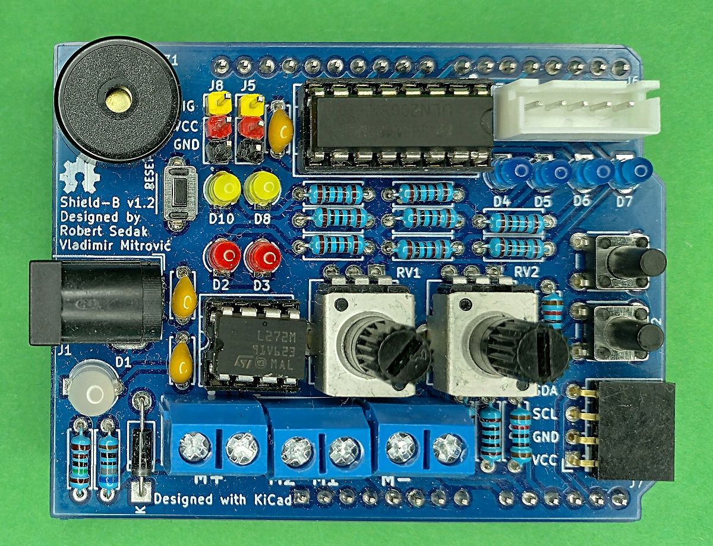
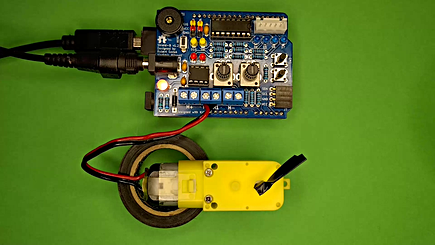

[Croatian version](README_HR-HR.md).

Introduction
============

Shield-B v1.2 is version of Arduino Uno based shield for student education compatible with BASCOM-AVR(C) and Arduino IDE.
During programming please keep in mind next design rules:
- D2, D4, D7, D8 — control step motor (J6)
- D5 — control DC motor (M1)
- D6 — control DC motor (M2)
- D9 — control servo motor (J5)
- D10 — control servo motor (J8)
- D13 — reserved for buzzer
- A0 — reserved for potentiometer RV1
- A1 — reserved for potentiometer RV2
- A2 — reserved for switch SW2 in INPUT_PULLUP mode
- A3 — reserved for switch SW3 INPUT_PULLUP mode
- A4,A5 — reserved for I2C communication with on board pull-up resistors (J7)

Contributors
------------
- Robert Sedak — features, Arduino expertise, schematic design, CAD design.
- Vladimir Mitrović — features, BASCOM-AVR expertise

Application
-----------
Robert Sedak made a video with examples programmed in Arduino IDE:

You can download examples for Arduino IDE from [here](examples/).

Bill Of Materials
-----------------
- 1 ea., PCB
- 1 ea., 680R ohm 1/4W 1% Resistor (R1)
- 8 ea., 1K ohm 1/4W 1% Resistor (R2-R8, R14)
- 2 ea., 10K ohm 1/4W 1% Resistor (R9, R10)
- 2 ea., 100R ohm 1/4W 1% Resistor (R11, R12)
- 1 ea., 1.5K ohm 1/4W 1% Resistor (R13)
- 1 ea., LED 5mm DUAL AKA (D1)
- 8 ea., LED 3mm (D2-D8, D10)
- 1 ea., 1N5817 (D9)
- 1 ea., 100nF (C1-C3)
- 1 ea., 14x7.5mm passive electronic piezoelectric buzzer SE (BZ1)
- 1 ea., Barrel Jack switch (J1)
- 3 ea., Screw terminal 2Pin (J2-J4)
- 2 ea., 1x3Pin 2.54mm Straight Pin Header - Black (J5, J8)
- 1 ea., Connector JST_XH_B5B-XH-A (J6)
- 1 ea., 1x4 pin 2.54mm Socket Connector - horizontal (J7)
- 2 ea., RV09 10K potentiometer - long shaft (RV1, RV2)
- 1 ea., 6x3x4.3mm SPST Momentary push switch (SW1)
- 2 ea., 6x6x10mm SPST Momentary push switch (SW1, SW2)
- 1 ea., 1x10Pin 2.54mm Straight Pin Header - Black
- 2 ea., 1x8Pin 2.54mm Straight Pin Header - Black
- 1 ea., 1x6Pin 2.54mm Straight Pin Header - Black
- 1 ea., 8 pin DIP Socket
- 1 ea., L272M
- 1 ea., 16 pin DIP Socket
- 1 ea., ULN2003

Design Files
------------
This project is designed using Open Source [KiCad](http://kicad.org/). Design files are located in the [design_files](design_files/) folder.  You can see the [schematic](images/shield-b_schematic.png).

Gerber files
------------
You can download gerber files from [here](gerber/shield_b_v1.2.zip).

Firmware
--------
This project can be programmed using the Open Source [Arduino](https://www.arduino.cc/) and [BASCOM-AVR(C)](https://www.mcselec.com/index.php?option=com_content&task=view&id=14&Itemid=103).
Arduino examples are located in [examples](examples/) folder.

License
-------
[Attribution-ShareAlike 4.0 International (CC BY-SA 4.0)](https://creativecommons.org/licenses/by-sa/4.0/)

You are free to:
- Share — copy and redistribute the material in any medium or format
- Adapt — remix, transform, and build upon the material

This license is acceptable for Free Cultural Works.
- The licensor cannot revoke these freedoms as long as you follow the license terms.

Under the following terms:
- Attribution — You must give appropriate credit, provide a link to the license, and indicate if changes were made. You may do so in any reasonable manner, but not in any way that suggests the licensor endorses you or your use.
- ShareAlike — If you remix, transform, or build upon the material, you must distribute your contributions under the same license as the original.

No additional restrictions — You may not apply legal terms or technological measures that legally restrict others from doing anything the license permits.

Reference Designs ARE PROVIDED "AS IS" AND "WITH ALL FAULTS". Authors DISCLAIMS ALL OTHER WARRANTIES, EXPRESS OR IMPLIED, REGARDING PRODUCTS, INCLUDING BUT NOT LIMITED TO, ANY IMPLIED WARRANTIES OF MERCHANTABILITY OR FITNESS FOR A PARTICULAR PURPOSE.
Authors may make changes to specifications and product descriptions at any time, without notice. The Customer must notrely on the absence or characteristics of any features or instructions marked "reserved" or "undefined." 
Authors reservesthese for future definition and shall have no responsibility whatsoever for conflicts or incompatibilities arising from future changes to them. The product information on the Web Site or Materials is subject to change without notice. Do not finalize a design with this info.

